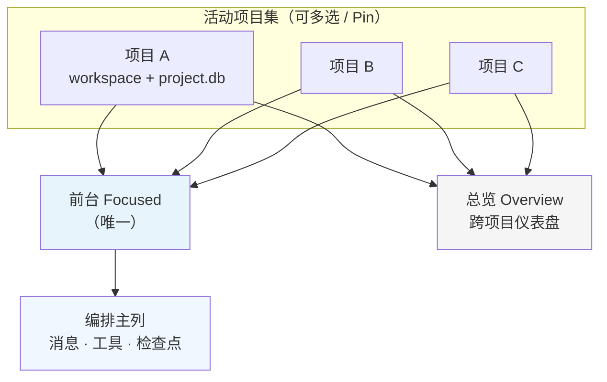
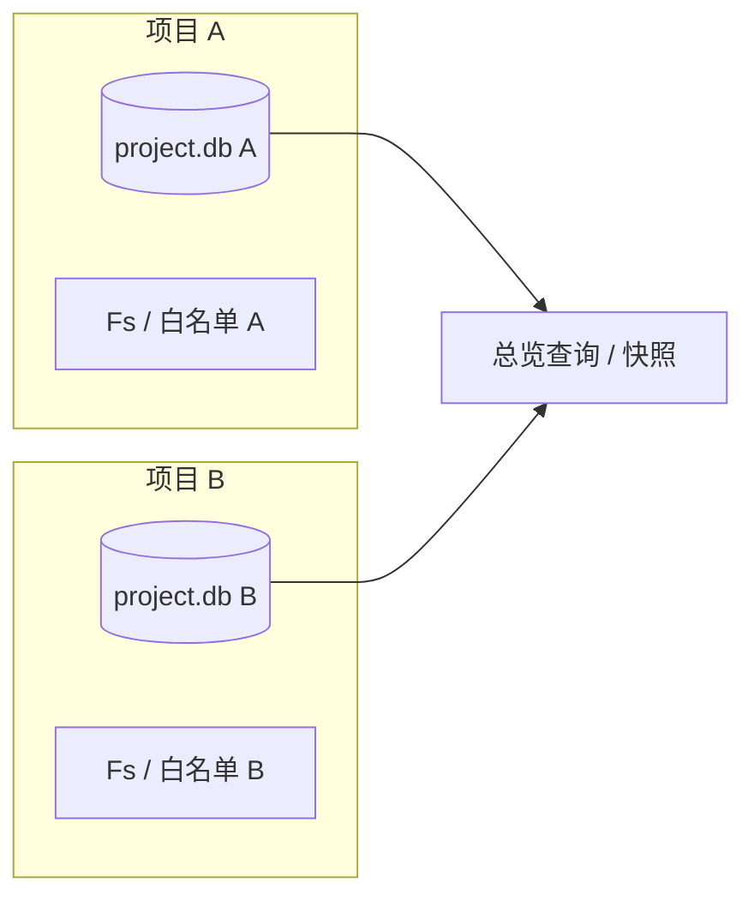
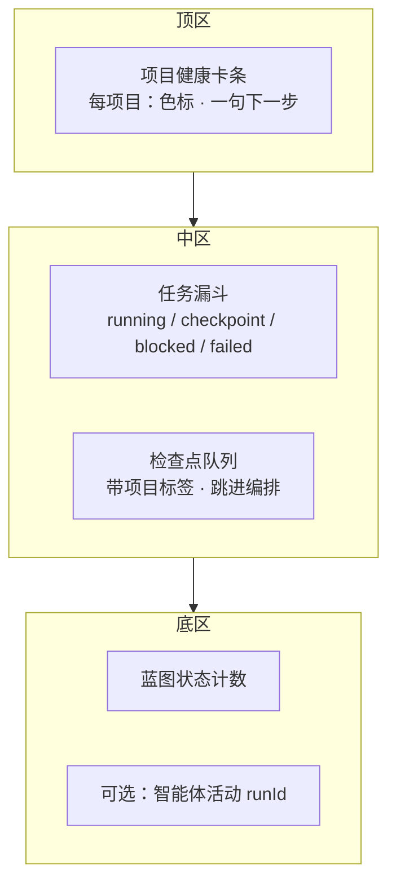
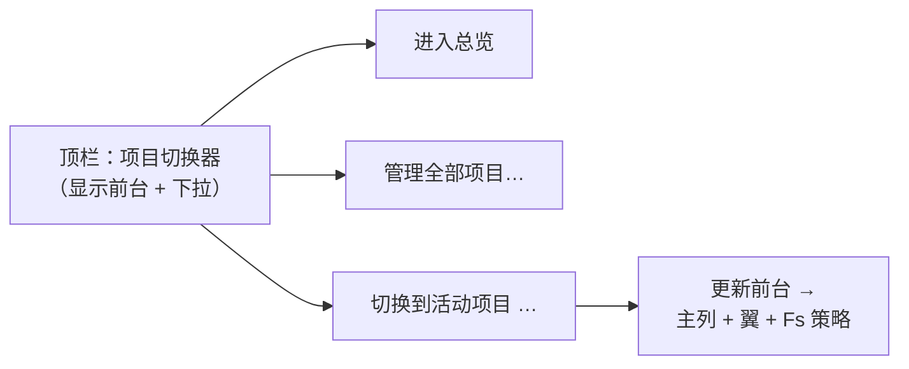

# Docwise 智能体优先界面设计（草案）

| 属性 | 说明 |
|------|------|
| 状态 | 草案（与 [`docwise-ui-shell-design.md`](./docwise-ui-shell-design.md) 并列，供选型或融合） |
| 关联文档 | [`docwise-design.md`](./docwise-design.md) 产品架构；壳层线框见 `docwise-ui-shell-design.md` |

---

## 传统交互与智能体优先的差异

| 维度 | 偏传统（IDE 心智） | **智能体优先** |
|------|-------------------|----------------|
| 主屏幕 | 资源树 + 编辑器占中心 | **对话与编排占中心**；文档/看板是「被拉起的上下文」 |
| 用户起点 | 找菜单、开文件、自己点功能 | **用自然语言说目标**；系统补问、给草案、请求确认 |
| 结构可见性 | 左栏常驻完整导航 | **按需展开**；结构（蓝图、任务树）以**卡片、时间线、内嵌面板**出现 |
| 工具与模型 | 人找按钮 | **智能体提议下一步**；人在关键处 **批准 / 纠正 / 选分支** |
| 项目与工作区 | 一次只「打开一个」工作区 | **多项目并行**：同时挂多个活动项目；**总览**看全局进度，编排流里带 **项目归属** |

目标不是去掉蓝图、任务或文件，而是把**默认注意力**放在：**「我和智能体在协作完成什么」**，其余能力是**对话与流的延伸**，而不是反过来。

---

## 设计原则（建议固化为团队共识）

- **编排面优先（Orchestration first）**：主列永远是「当前协作流」——用户消息、智能体回复、工具结果摘要、待你拍板的检查点。
- **上下文附着（Context attachment）**：蓝图、任务节点、打开的文件、预览，都是**附着在消息或当前焦点上的可展开块**，而不是必须先选左栏再工作。
- **可逆与可解释**：重要写入、状态迁移、白名单外路径，用**短摘要 + 展开详情**；关键步支持**撤销或再生成**（与后端能力逐步对齐）。
- **人只在刀刃上介入**：默认让智能体推进；仅在冲突、缺信息、高风险操作时**抬高 UI 权重**（模态、置顶卡片、阻止继续直到确认）。
- **结构仍可被「看见」**：需要时一键展开「蓝图全貌 / 任务树 / 文件树」——**从对话里钻取**，而不是从空壳导航开始。
- **多项目可并行**：用户常在多个工作区上与智能体同时协作；界面必须回答两件事——**我现在在处理哪几个项目**、**整体推进到哪了**（见下节）。

---

## 多项目并行与整体进度总览

智能体场景下，「单项目独占宿主」容易成为瓶颈：人希望**并行推进**多条线，又需要**一张图**看清所有项目的风险与等待点。

### 概念分层

| 概念 | 说明 |
|------|------|
| **活动项目（Active）** | 用户明确「当前在跟进」的项目集合（可多个）；每个对应一个工作区根 + `project.db`。 |
| **前台项目（Focused）** | 编排主列当前绑定的**一个**项目；消息、工具、文件解析默认落在此上下文（消息上可显式 **@ 另一项目** 切换或拆线程，后续）。 |
| **总览（Overview）** | **跨项目**只读聚合：任务状态分布、阻塞检查点、进行中的运行、蓝图是否待批等；**不替代**各项目内的详细看板。 |

### 概念关系（图示）

下列关系强调：**活动**是集合、**前台**是集合中当前绑定编排的那一个、**总览**跨集合做只读投影。



**数据边界（简图）**：每个活动项目各自持有工作区根、白名单策略、`project.db`；总览读取多库的**聚合视图**，不写回业务状态。



### 导航与切换

- **顶栏项目切换器**：显示 **前台项目**；下拉列出**活动项目** + 「进入总览」+「管理全部项目…」。
- **活动项目列表**：类似「固定标签」或 **Pin**（来自项目中心）；未 Pin 的仍可在项目中心打开，打开时可选 **加入活动集**。
- **快捷键 / 命令面板**（后续）：`切换到 <项目名>`、`打开总览`。

### 总览界面（建议独立路由或项目中心的一键 Tab）

**目标**：一屏回答「所有我在跟的项目，整体卡在哪」。

建议模块（数据均来自各项目 `project.db`，需宿主能**连接多个库**或**轮询快照**——见实现备忘）：

| 模块 | 展示内容（示例） |
|------|------------------|
| **项目卡条** | 每项目：名称、分组、**健康色**（无阻塞 / 有待办检查点 / 有失败任务）、**下一步一句人话**（可由规则或轻量汇总生成）。 |
| **任务漏斗** | 跨项目汇总：`running` / `waiting_checkpoint` / `blocked` / `failed` 数量；**可点击钻取**到该项目任务视图。 |
| **检查点队列** | 所有 `open` 或 `waiting_checkpoint` 关联的检查点列表，带 **项目标签**、任务标题、**跳转回复**（打开对应项目编排并定位）。 |
| **蓝图状态** | 各项目蓝图 `draft` / `approved` / `active` / `revised` 计数；标出需人批准的项。 |
| **智能体活动（可选）** | 若有流式 `runId` 与项目绑定：显示「正在跑」的回合数；无则先省略。 |

**空状态**：仅单个活动项目时，总览可退化为「单项目仪表盘」，或引导 Pin 第二个项目。

**总览一屏的信息架构（模块占位）**：



### 编排流里的「项目归属」

- 每条用户消息、智能体气泡、工具摘要旁显示 **项目徽章**（至少**前台项目**始终可见）。
- **跨项目引用**：用户说「顺便看下 B 项目的任务」——可 **切换前台** 或 **新开子线程**（设计留钩，实现可分阶段）。

### 与当前实现的差距（备忘）

- 现况多为 **单一 `SharedProject` / 单次 `workspace_open`**：要支撑多项目并行，后端需演进为例如 **项目 id → 已打开的 `Arc<ProjectContext>` 映射**（或懒加载 + 连接池），以及 **前台指针**；总览需 **批量查询** 或 **定时聚合缓存**。
- **白名单与 FS**：每个活动项目各自策略；切换前台时切换 **当前 Fs 策略 / ActiveContext** 绑定，避免串项目写盘。

---

## 推荐布局：「单主列 + 可折叠上下文翼」

大屏仍可用多栏，但**主次关系颠倒**：

```text
┌────────────────────────────────────────────────────────────┬──────────────┐
│                                                            │  上下文翼     │
│              主列：统一编排 / 对话 / 流式事件                  │  （可折叠）   │
│                                                            │              │
│   · 输入框常驻底部（或底部悬浮条）                           │  · 当前焦点   │
│   · 时间序：用户 / 规划 / 执行 / 系统                        │    蓝图摘要   │
│   · 工具调用：可折叠的「刚刚做了什么」                        │  · 任务节点   │
│   · 检查点：内联卡片「需要你选 A/B」                         │  · 文件/预览  │
│                                                            │  · 项目/白名单 │
│                                                            │              │
└────────────────────────────────────────────────────────────┴──────────────┘
```

- **主列**：智能体优先的「戏台」；**不要**把编辑器默认铺满中间（除非用户明确进入「专注写作」模式）。
- **上下文翼**（右侧或左侧均可，建议**右侧**与现有壳层「对话在右」可对齐后**对调**：对话改中、翼改窄）：展示**与当前消息或选中气泡绑定的**结构化信息；**无选中时**显示「当前项目 + 进行中的任务 + 最近触碰的文件」轻量仪表盘。
- **窄屏**：上下文翼变为 **从主列滑出的抽屉** 或 **点击消息上的「查看上下文」** 再出现。

**与多项目并行的顶栏关系（简图）**：



这与「项目中心 → 主壳」不矛盾：**打开项目后**直接进入上述编排布局；项目中心仍可保留为**冷启动列表**，但可在编排顶栏用 **项目切换器** 弱化「先选壳再说话」的断裂感。

---

## 关键交互模式

### 从意图开始，而不是从目录开始

- 顶栏或输入框上方：**一句话目标**（例：「把客户 A 的部署文档按新蓝图补齐」）。
- 系统响应：**拟议计划**（可编辑的步骤列表）→ 用户确认后写入任务/蓝图（由智能体调工具，人在卡片上点「批准」）。

### 蓝图与任务如何出现

- **内嵌在对话里**：「这是我理解的蓝图结构」→ 可展开表格 / 小看板；**在上下文中编辑**优于跳到独立「蓝图页」。
- **需要全景时**：上下文翼切换到 **蓝图模式** 或全屏 **聚焦覆盖层**（overlay），仍可从对话一条链接打开（「打开完整蓝图视图」）。

### 文件与预览

- 智能体引用文件时，消息旁出现 **文件芯片（chip）**；点击 → 在翼中打开 **预览 + 可选并排编辑**。
- **专注写作模式**（显式切换）：临时把布局切成「编辑 + 预览」双栏，**退出即回到编排优先**——避免长期停留在 IDE 默认态。

### 检查点与用户拍板

- 设计文档中的 **waiting_checkpoint**：在编排流里用 **高对比卡片** 呈现，**阻塞后续智能体步骤**直至用户回复或选择；与 [`docwise:checkpoint-changed`](./docwise-design.md) 事件对齐时，卡片状态与任务树节点同步。

### 项目与白名单

- **不占据首屏心智**；在上下文翼底部或设置里：**「本项目可访问位置」** 用人类可读列表展示；智能体若越权，**在对话内**解释并给出「去调整白名单」链接。

---

## 与现有壳层文档的关系

- [`docwise-ui-shell-design.md`](./docwise-ui-shell-design.md) 描述的是 **强结构、IDE 友好** 的三列壳层，适合**熟手**与**精确点选**。
- 本文描述 **智能体优先** 的默认体验，可通过以下方式落地：
  - **方案 A**：新产品默认用编排布局；传统三列作为 **「视图 → 经典布局」** 切换。
  - **方案 B**：编排为主，**蓝图 / 任务 / 工作区** 作为上下文翼的 **Tab**，不再做左侧永久宽导航。
  - **方案 C**：保留项目中心；进入项目后 **默认编排页**，左侧窄条仅保留 **模式切换**（编排 / 经典 / 设置）。

实现阶段选 A/B/C 之一即可，无需一次做满。

---

## 风险与克制

- **纯对话易迷失**：必须保留 **轻量结构锚点**（进行中的任务名、当前蓝图标题、项目名），避免用户不知道「在哪」。
- **流式信息过载**：工具细节默认折叠；**仅错误与待批准**默认展开。
- **多智能体**：规划与执行的发言用 **视觉区分**（头像、色条、标签），避免一团文字。

---

## 修订记录

| 日期 | 说明 |
|------|------|
| 2026-04-14 | 初稿：智能体优先原则、单主列+上下文翼、关键交互、与壳层文档关系及落地选项 |
| 2026-04-14 | 补充：**多项目并行**（活动/前台/总览）、总览界面模块、编排流项目徽章、与单例 `SharedProject` 的演进备忘 |
| 2026-04-14 | 补充：Mermaid 图示（概念关系、多库总览边界、总览模块 IA、顶栏与前台切换） |
