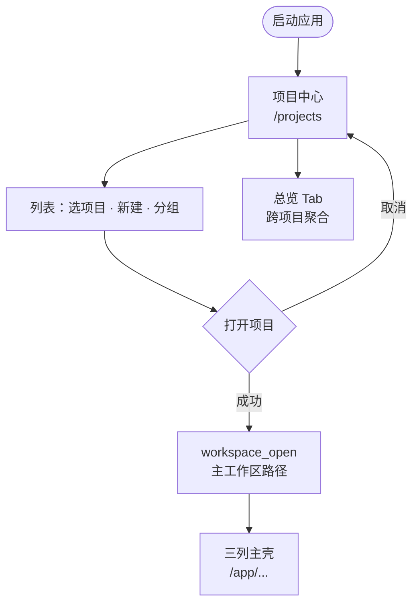
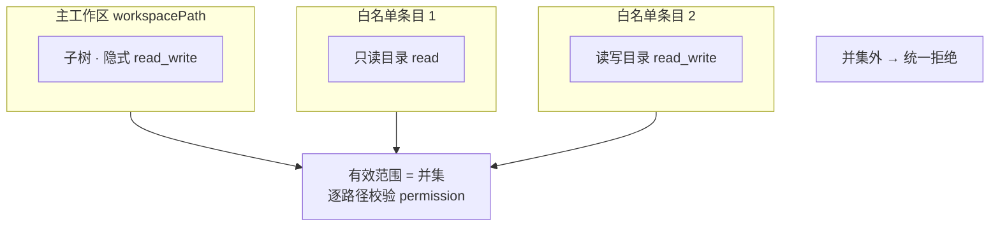
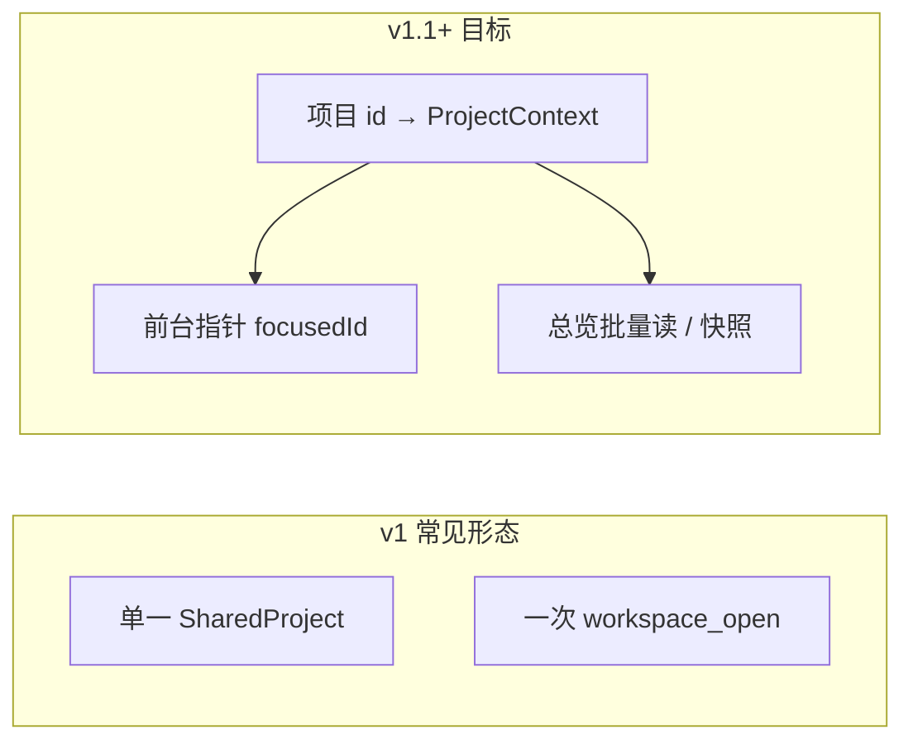
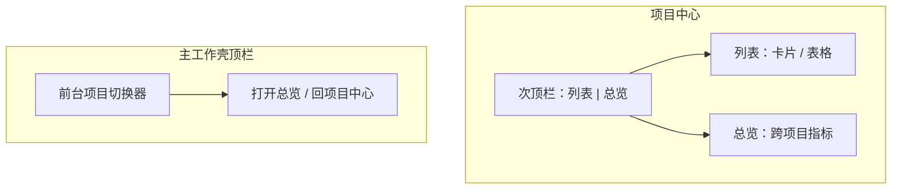
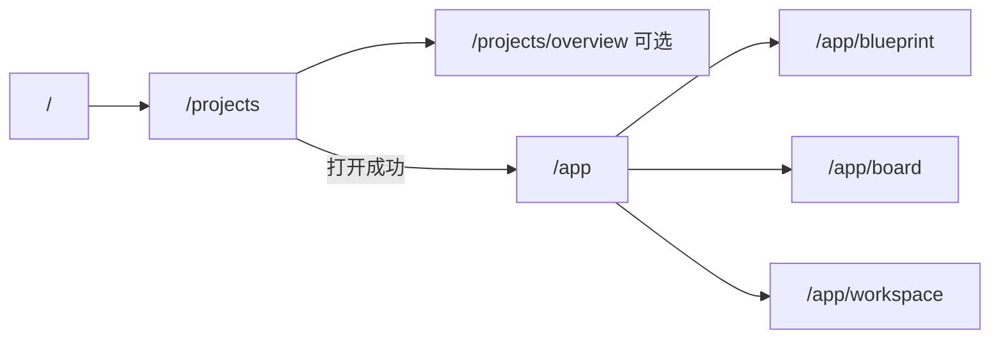

# Docwise 前端界面壳层设计

| 属性 | 说明 |
|------|------|
| 状态 | 草案（供实现与评审） |
| 关联文档 | [`docwise-design.md`](./docwise-design.md) 产品与应用架构；**智能体优先**界面思路见 [`docwise-ui-agent-first-design.md`](./docwise-ui-agent-first-design.md) |
| 技术栈 | Nuxt 4、Nuxt UI、Tauri 2 |

---

## 设计目标

- 将当前「单页试跑」提升为**可长期使用的桌面工作界面**：结构清晰、符合常见 IDE / 协作工具心智（左侧导航 + 中间工作区 + 右侧对话）。
- 与现有后端概念对齐：**工作区**、**蓝图**、**任务**、**文档与预览**、**统一对话框**、[`ActiveContext`](./docwise-design.md)（`workspaceId`、`filePath`、`blueprintId`、`taskId` 等）。
- **v1 壳层**优先：布局、导航、占位与数据流接口；各业务视图可分期填充，避免一次做满导致返工。

---

## 应用层级：项目中心 → 主工作壳

用户启动应用后，**先进入「项目」层面**，再进入下文的三列主壳。避免每次手动粘贴工作区路径，并支持多文档体系（多工作区）的**列表、分组与一键打开**。

**应用层级与典型路径（图示）**：



### Docwise 项目（应用层概念）

此处「**项目**」指 **Docwise 应用内的一条管理单元**，不是 `project.db` 里的数据库名。每个项目至少包含：

| 字段（建议） | 说明 |
|--------------|------|
| `id` | 稳定唯一标识（UUID） |
| `name` | 展示名称 |
| `group` | **分组**（见下）：用于侧栏筛选、折叠列表 |
| `workspacePath` | **工作区根目录**（绝对路径）：与 [`docwise-design.md`](./docwise-design.md) 中 **Workspace** 一致；**主锚点**：`project.db`、`.agent`、默认资源树与蓝图落盘范围均以此为准；打开项目时调用 `workspace_open` |
| `pathAllowlist` | **路径白名单**（见下）：本项目允许智能体与编辑器访问的**额外目录**及**读写权限**；与工作区根共同构成「可访问文件宇宙」的边界 |
| `createdAt` / `updatedAt` | 可选，便于排序与审计 |

**分组**用于「项目分组」：实现上可采用**单层分组**（如「客户 A / 内部 / 归档」），列表 UI 按 `group` 聚类展示；后续若需要多标签，再扩展为 `tags[]` 而不破坏 `group` 主分类。

### 路径白名单与权限（项目级）

用户不仅需要「一个工作区目录」，还需要明确：**在本项目下，应用与智能体可以读/写哪些路径**。语义上接近「白名单 + 每路径权限」，用于安全与合规（例如只允许写客户仓库子目录、只读引用某共享资料库）。

#### 数据模型（建议）

`pathAllowlist` 为有序列表（展示时可排序），每一项例如：

| 字段 | 说明 |
|------|------|
| `path` | 绝对路径，指向**目录**（v1 只支持目录粒度，便于与资源树、沙箱校验一致；单文件可放在后续） |
| `permission` | `read`（只读）或 `read_write`（可读可写：对应智能体 `file_write` / `file_edit` 等） |
| `label` | 可选，短标签（如「客户交付物」「只读规范库」），便于 UI 展示 |

**与工作区根的关系：**

- `workspacePath` **隐含至少具备**「在该根下读写」的业务需求（数据库、任务、默认文档树），实现上可视为**自动有一条** `workspacePath` → `read_write` 的**隐式条目**，不必重复出现在列表里；或在列表中**锁定展示**第一条为「主工作区（读写）」且不可删，仅可改路径（改路径等于迁移项目，需强提示）。
- **白名单条目**用于**额外挂载**：例如 `D:\refs\company-styleguide` → `read`，或 `E:\client-a\drop` → `read_write`。
- **有效访问范围** = `workspacePath` 整棵子树 ∪ 所有 `pathAllowlist[].path` 的整棵子树（在各自 `permission` 约束下）。  
  **不在并集内的路径**：编辑器打开、预览、`workspace_read_*`、智能体 `file_*` 均应拒绝（统一错误码与文案，避免半放行）。

**有效路径宇宙（示意）**：主工作区与附加目录在磁盘上可能不相交；裁决时取**并集**，每条路径受自身 `permission` 约束。



**冲突与越权：**

- 若某 `pathAllowlist.path` **落在 `workspacePath` 子树内**，可与隐式规则合并（去重，权限取**更宽**还是**更窄**需在实现里定死：建议取**更窄**以满足「显式收紧」）。
- 若用户将 `read` 目录下文件拖入「可写」操作，UI 与后端均拦截。

#### 界面落点

- **新建项目**：在选定 `workspacePath` 之后，增加一步或折叠面板 **「可访问目录」**：默认仅主工作区；**添加路径** 选择文件夹 + 选择 **只读 / 可读写**。
- **编辑项目 / 项目设置**（列表 **[···] → 设置** 或详情带内）：表格管理白名单（路径、`permission`、删除）；保存时做路径存在性校验与重叠提示。
- **主壳内**：可选在设置或状态栏显示「当前项目 N 个扩展目录」；某操作因白名单失败时，toast 链到项目设置。

#### 与后端 / agentool 的衔接（实现备忘）

- 当前 `agentool::fs::FsContext` 为**单一 `root_canonical` + `allow_outside_root`**。多根 + 每根权限需要：**应用层策略对象**（打开项目时根据清单构造），或在后续为 fs 工具增加「多根策略」适配层；**校验逻辑必须与 UI 白名单一致**，避免仅前端限制。
- `workspace_read_text_file` / 后续写入类命令同样应走同一套**路径裁决**，保证人读与智能体读写边界一致。

**与后端现状**：`workspace_open` 仍只接收主 `workspacePath`；**白名单仅存在于项目清单 JSON** 直至增加「随项目加载策略到内存 / Tauri State」的实现。文档先行，避免后期与安全模型打架。


### 项目中心界面（第一屏）

#### 布局示意（全宽、无右侧对话栏）

与主工作壳区分：**项目中心独占整窗**，不显示蓝图/任务/工作区三列与右侧智能体栏；心智是「选场子再进场」。

```text
┌────────────────────────────────────────────────────────────────────────────┐
│  顶栏：产品标识 / 「项目」标题                      [全局搜索可选]  [设置]   │
├──────────────┬─────────────────────────────────────────────────────────────┤
│              │  次顶栏：**新建项目**   排序   **列表 | 总览** 切换（见下「多项目」） │
│   分组侧栏    ├─────────────────────────────────────────────────────────────┤
│              │                                                             │
│  · 全部 (n)  │   主内容区：项目 **卡片栅格** 或 **紧凑表格**（实现二选一）    │
│  · 分组甲    │   每项展示：名称、分组标签、工作区路径（截断+tooltip）、        │
│  · 分组乙    │   最近打开时间；主操作 **[打开]**，次操作 **[···]**（编辑/删除） │
│  · 未分组    │                                                             │
│              │   （可选）选中一行时，右侧 **窄详情带**：完整路径、[在资源管理 │
│  [+ 管理分组] │   器中显示]（系统打开文件夹，后续接 Tauri）                    │
│              │                                                             │
└──────────────┴─────────────────────────────────────────────────────────────┘
```

**窄屏降级**：分组侧栏收入 **抽屉** 或顶栏 **分组下拉**；主列表全宽不变。

#### 分区说明

| 区域 | 职责 |
|------|------|
| **顶栏** | 品牌与页面标题（「项目」）；设置入口；可选全局按名称搜索项目。 |
| **分组侧栏** | 筛选列表：「全部」+ 各 `group` + 「未分组」；底部可放「管理分组」（重命名、合并、删除空分组，v1 可只做侧栏内联编辑）。 |
| **次顶栏 / 工具条** | **新建项目**（主按钮）；排序；可选「仅显示路径无效」筛选。 |
| **主列表** | 项目集合的主交互面；**打开**进入主工作壳；路径无效行用警示样式。 |
| **详情带（可选 v1）** | 选中项的完整 `workspacePath`、备注字段（若后续扩展）；不挡主列表操作。 |

#### 行为与流程（承接前文）

- **主列表**：卡片或表格展示项目（名称、分组、工作区路径摘要、最近打开时间）。
- **操作**：**新建项目**（表单：名称、分组、主工作区目录、**路径白名单与权限**）、**编辑**、**删除**（仅删清单项，不删磁盘目录；需二次确认）、**打开**。
- **打开流程**：校验路径为目录 → `workspace_open(workspacePath)` → 成功后跳转**三列主壳**（`ActiveContext.workspaceId` 已由现有逻辑同步）。
- **空状态**：无项目时主内容区大号引导 + **新建项目**；路径无效时在列表上标红并提示重新指定目录。

### 与主壳的关系

- 三列布局仅在**已打开某一项目（工作区）**后展示；顶栏或菜单提供 **「返回项目列表」**（可选：关闭当前 `ProjectContext` 或仅切路由，实现阶段再定是否 `workspace_close`）。
- 左栏底部的「当前工作区路径」改为展示**当前项目名 + 路径**，与项目记录一致。

### 多项目并行与整体总览

智能体协作常见 **同时推进多个工作区**；仅「一次只打开一个 `workspace_open`」会从产品上卡住。壳层上建议：

- **项目中心**：次顶栏 **「列表 | 总览」**。**总览** 一屏聚合：各项目任务状态、待处理检查点、蓝图是否待批等（指标定义与交互细节见 [`docwise-ui-agent-first-design.md`](./docwise-ui-agent-first-design.md)「多项目并行与整体进度总览」）。
- **主工作壳顶栏**：**前台项目切换器**（当前聚焦哪一个工作区）+ 入口 **「打开总览」**；支持 **多个活动项目**（Pin / 最近打开），而非单一全局状态。
- **实现演进**：从单一 `SharedProject` 走向 **项目 id → `ProjectContext` 映射 + 前台指针**；总览需跨库查询或聚合快照，与后端分期对齐。

**多项目宿主状态（目标形态，与 v1 单例对照）**：



**项目中心「列表 | 总览」与主壳顶栏（信息架构）**：



---

## 整体布局（主工作壳）

采用**三列结构**（大屏默认）；窄屏时可降级为抽屉/标签切换（实现阶段再定断点）。**进入条件**：已从项目中心打开某一项目。

```text
┌──────────┬────────────────────────────────────────────┬────────────────────┐
│          │                                            │                    │
│  主导航   │              主工作区（随导航变化）          │   统一对话 / 智能体   │
│  (Icon + │   · 蓝图视图                                 │   · 消息流           │
│   文案)  │   · 任务看板                                 │   · @ 路由（后续）    │
│          │   · 文档 + 编辑 + 预览（IDE 式）              │   · 流式事件摘要      │
│          │                                            │                    │
└──────────┴────────────────────────────────────────────┴────────────────────┘
```

- **左列（窄）**：应用级入口，切换「当前主任务」——看蓝图、盯任务、读写给预览。
- **中列（宽）**：当前选中入口下的**具体内容**；其中「文档」模式采用 **VS Code 式子布局**（见下文）。
- **右列（中等宽度，可拖拽调整）**：**统一对话框**（规划 / 执行智能体、用户输入、系统消息）；与设计文档中的「统一对话框」一致。

---

## 左侧主导航（建议三项 + 底部设置）

与 [`docwise-design.md`](./docwise-design.md) 中前端模块对应关系如下。

| 入口 | 用户心智 | 对应设计模块 | 主区域展示内容（v1） |
|------|----------|--------------|----------------------|
| **蓝图** | 我要看文档集长什么样、条目与约束 | `project/` | 蓝图列表 → 详情 / 条目表；只读或简单编辑占位 |
| **任务** | 我要看树状任务与状态 | `board/` | 任务列表或树；状态徽章；点击进入详情占位 |
| **工作区** | 我要像 IDE 一样浏览文件、看正文、看预览 | `editor/` + `preview/` + 资源树 | 见下一节「IDE 式工作区」 |

**可选第四项（v1 末或 v2）**：**时间轴**（`timeline/`）——按执行智能体维度展示工具与文件操作；可先放在任务详情内，不必占主导航一位。

**底部固定区**：当前**前台项目**名称与工作区路径摘要；**切换项目**打开项目切换器或返回项目中心 / **总览**。不再在主导航重复「首次打开工作区」——该动作集中在**项目中心**完成。

---

## IDE 式工作区（「工作区」入口下的中栏）

当用户点击左侧 **工作区** 时，中栏采用 **三竖条子布局**（逻辑上类似 VS Code，比例可调）：

```text
┌─────────────┬──────────────────────────┬──────────────────────────┐
│  资源树      │        编辑器              │        预览               │
│  (目录/文件) │   Markdown 或纯文本        │   HTML（preview_render）  │
│             │   可接 workspace_read_*    │   与文件或缓冲区绑定       │
└─────────────┴──────────────────────────┴──────────────────────────┘
```

- **资源树**：调用 `workspace_list_directory`，相对路径浏览；点击文件 → 更新 `ActiveContext.filePath` 并加载 `workspace_read_text_file`（v1 可先只读）。
- **编辑器**：展示当前文件内容；未保存状态在设计文档中为 **FileBuffer**（v1 可先内存态 + 简单「已修改」提示）。
- **预览**：对应当前编辑器内容或已保存文件，调用现有 `preview_render`（或后续文件路径 + 后端读盘）；与 [`docwise-design.md`](./docwise-design.md) 场景四一致。

**与 ActiveContext 的联动**：打开文件时 `filePath` 写入后端 `active_context_replace` 或后续增量 API；侧栏对话、任务视图可读取同一上下文。

---

## 右侧统一对话框

- **固定占据右栏**（或可折叠为窄条，展开后恢复宽度），避免与中间内容抢焦点。
- **内容**：用户消息、规划/执行智能体回复、工具执行摘要（可与流式 `PlanningStreamEnvelope` 日志合并或分层展示）。
- **v1**：保留现有试跑能力（provider、模型、启动流式）；逐步改为「会话列表 + 当前会话」时可再拆设计。
- **后续**：@ 用户 / @ 规划 / @ 执行、检查点等待态与高亮（与 `docwise:checkpoint-changed`、`waiting_checkpoint` 对齐）。

---

## 视觉与交互原则

- **密度**：桌面应用向；使用 Nuxt UI 的 `UCard`、`USidebar`、分割条（或 `Resizable` 类组件）保持专业感，避免整页散落的表单。
- **状态可见**：顶部或左下角显示「已连接工作区」「当前蓝图 / 任务 / 文件」短标签，来源以 `active_context_get` 为准。
- **导航不变式**：切换左侧入口时，**不强制清空**右栏对话；中间区按入口替换。若需「上下文不一致」提示（例如蓝图已改、任务已关），用轻量 `toast` 或顶栏横幅。

---

## 路由与实现建议（Nuxt）

- **布局 A**：`layouts/projects.vue`（或默认首页布局）——**项目中心**全宽，无三列。
- **布局 B**：`layouts/app.vue`（或 `default.vue`）——**三列主壳**；`beforeEnter` 或中间件校验：若未打开工作区则重定向到 `/projects`。
- 建议路由骨架（名称可调整）：

  - `/` → 重定向到 `/projects`（或上次打开的 `/app/...`，需持久化 `lastProjectId`）。
  - `/projects` 项目列表与新建/编辑；可选 `/projects/overview` **跨项目总览**（或与列表同页 Tab）。
  - `/app` 三列壳层根；子路由例如：
    - `/app/blueprint`、`/app/blueprint/:id`
    - `/app/board`、`/app/board/task/:id`
    - `/app/workspace`（IDE 子布局）

- **状态**：**活动项目集**、**前台项目 id**、各项目 `pathAllowlist` 与 `useDocwiseActiveContext`（可按项目分槽或切换时重绑）、对话流式 composable 一并放入 **pinia 或 useState**；项目清单与总览缓存可独立 store。

**路由骨架（示意）**：



---

## v1 交付边界

**本壳层设计在 v1 应完成：**

- **项目中心**：列表、分组展示、新建/编辑/删除（清单级）、打开项目 → `workspace_open` → 进入主壳。
- 三列布局与左侧三入口可切换；中栏三种占位页可区分。
- 工作区入口下资源树 + 双栏（编辑 + 预览）的**静态或只读闭环**（能打开目录、读文件、预览）。
- 右栏对话区可继续使用现有流式试跑，布局融入而非悬浮单卡。

**可延至 v1.1：**

- **多项目宿主**：多 `ProjectContext`、前台切换、**跨项目总览**数据聚合（见 `docwise-ui-agent-first-design.md`）。
- 项目清单的 **Tauri 后端持久化命令**（若 v1 仅用前端本地文件即可暂缓）。
- FileBuffer 保存、`workspace_write` 类命令、冲突提示。
- 蓝图 / 任务的完整 CRUD UI（可先表格 + `invoke` 列表）。
- 右栏会话持久化与 @ 路由。

---

## 修订记录

| 日期 | 说明 |
|------|------|
| 2026-04-14 | 初稿：三列壳层、左栏蓝图/任务/工作区、IDE 式子布局、右栏对话、路由与 v1 边界 |
| 2026-04-14 | 补充：**项目中心**（新建/分组/工作区目录/打开）、应用层级与路由 A/B、与 `workspace_open` 的衔接 |
| 2026-04-14 | 补充：**项目中心布局示意**（顶栏、分组侧栏、工具条、主列表、可选详情带）与分区表、窄屏说明 |
| 2026-04-14 | 补充：**路径白名单**（`pathAllowlist`、`read`/`read_write`）、与工作区根关系、UI 落点、与 fs/agent 衔接备忘 |
| 2026-04-14 | 补充：**多项目并行**、项目中心 **列表/总览**、主壳顶栏切换器；路由与状态 store 调整；v1.1 多宿主 |
| 2026-04-14 | 补充：Mermaid 图示（应用层级流程、路径并集、多宿主演进、项目中心与主壳 IA、路由骨架） |
